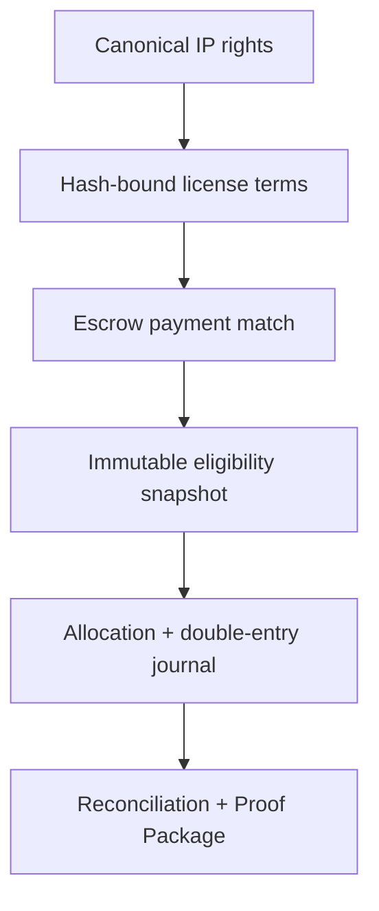
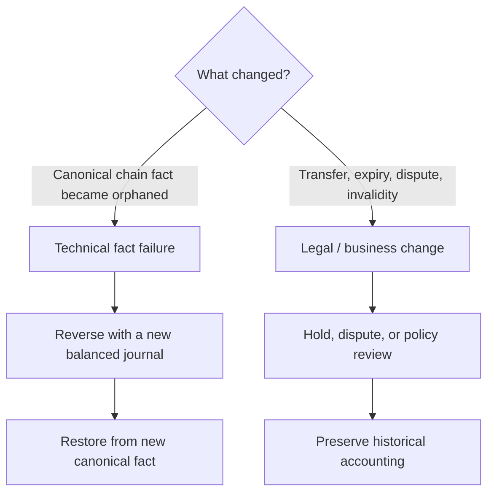
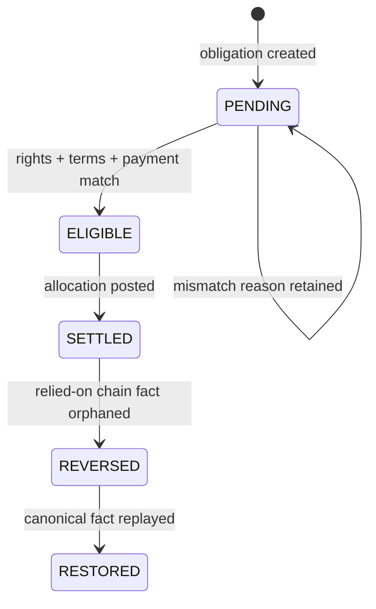
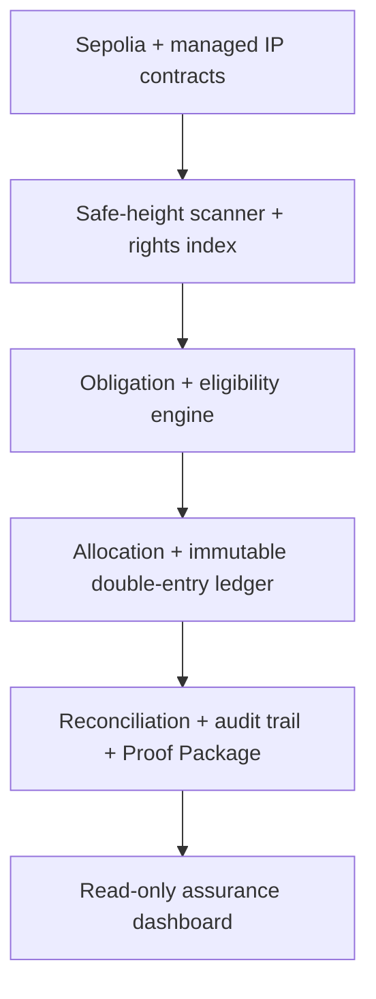

# IP Breaker Rights-Aware Settlement Backend

> **A rights-aware, reorg-safe settlement and assurance engine for IP-backed real-world assets.**

IP Breaker answers a question that a transfer event alone cannot:

> **Why is this IP licensing payment eligible to become auditable revenue?**

It connects canonical IP-rights facts, hash-bound license terms, escrow payment, immutable eligibility evidence, deterministic allocation, double-entry accounting, reorganization recovery, reconciliation, and reproducible proof packaging in one Java backend.

[See the architecture](docs/architecture.md) · [Run the demo](docs/demo-guide.md) · [Choose a talk track](docs/sprint-10-demo-talk-tracks.md) · [Inspect Sprint 10](docs/sprint-10.md)

## The 30-second view



The system does not treat an IP NFT as legal ownership, and it does not treat `LicenseFunded` as sufficient settlement authority. It records the exact rights, terms, payment, safe block, and projection versions used for each decision—then preserves the accounting consequences without rewriting history.

## Why this is different

| Question | Typical wallet / NFT demo | IP Breaker |
| --- | --- | --- |
| What does a payment prove? | A transfer happened | A transfer happened **and** is separately tested against rights, terms, payer, asset, and amount |
| What survives an audit? | Current database state | Immutable decision snapshots, source chain data, allocation plans, and linked journals |
| What happens on reorg? | Rescan or overwrite | Retain orphaned facts, reverse with a new journal, then restore idempotently from the new canonical chain |
| What happens on dispute? | Often conflated with rollback | `HELD / DISPUTED` blocks new action without pretending a legal change erased historical chain facts |
| How is “all clear” shown? | No error row found | `MATCHED` only after all reconciliation checks actually ran; otherwise `UNKNOWN` |
| What can be exported? | Transaction JSON | Reproducible normalized-JSON Settlement Proof Package with SHA-256 content digest |

## The core engineering distinction



Only the technical-fact path is an automatic reversal. A later transfer, expiry, or dispute must not silently rewrite a settlement that was valid under the facts used at the time.

## Settlement lifecycle



Business control is deliberately orthogonal to this lifecycle: `CLEAR`, `HELD`, and `DISPUTED` decide whether new action is permitted; they do not overwrite the historical settlement state.

## System map



| Layer | Notable safeguards |
| --- | --- |
| Chain ingestion | Safe-height scanning, database lease, bounded RPC retries, parent-hash checks, common-ancestor recovery |
| Rights projection | Runtime code-hash gate, deployment metadata, ordered events, unknown-event retention, deterministic rebuilds |
| Eligibility | Canonical terms hash, payer/currency/amount checks, rights-owner alignment, immutable decision snapshots |
| Accounting | Deterministic allocation, business-key idempotency, balanced original/reversal/restoration journals |
| Assurance | Index readiness, technical risks, business controls, reconciliation checkpoints, reproducible content digest |

For the detailed component and failure model, see [Architecture and trust boundaries](docs/architecture.md).

## What to show in a live explanation

1. **Settle** — create hash-bound terms, observe an escrow payment, and show the eligibility snapshot plus balanced journal.
2. **Break the chain fact** — simulate a development-chain reorganization; show the original evidence retained and a separate reversal journal.
3. **Restore and prove** — replay the canonical payment, show the restoration journal, inspect risk/reconciliation state, and export the Proof Package.

The dashboard reads the same application APIs as other clients; it does not maintain a second demo-only truth source.

```text
http://localhost:8080/sprint10-dashboard.html
```

Use the [step-by-step demo guide](docs/demo-guide.md) for a 3-, 7-, or 12-minute presentation.

## Choose your audience

| Audience | Lead with | Then prove | Suggested route |
| --- | --- | --- | --- |
| Interviewer | Reorg-safe state and immutable accounting | Idempotency, transaction boundaries, projections, reconciliation | [3–5 minute technical narrative](docs/sprint-10-demo-talk-tracks.md#一面试版约-35-分钟) |
| Hackathon judge | “Payment” versus “eligible revenue” | Live `SETTLED → REVERSED → RESTORED` lifecycle | [2 minute product demo](docs/sprint-10-demo-talk-tracks.md#二hackathon-版约-2-分钟) |
| Investor | Continuous evidence for IP licensing cash flow | Rights-to-ledger trace, risk state, reconciliation, proof package | [90 second business narrative](docs/sprint-10-demo-talk-tracks.md#三投资者版约-90-秒) |

## Technology and modules

Java 21 · Spring Boot 3.5 · Maven · MySQL 8.4 · Redis 7.4 · Flyway · Web3j · Docker Compose

| Module | Responsibility |
| --- | --- |
| `ip-breaker-wallet-bootstrap` | Executable application and runtime configuration |
| `ip-breaker-wallet-api` | REST controllers, validation, and error mapping |
| `ip-breaker-wallet-application` | Use-case orchestration and transaction boundaries |
| `ip-breaker-wallet-domain` | Business models, state transitions, and invariants |
| `ip-breaker-wallet-rights` | Contract events, deterministic decoders, rights projections, and query ports |
| `ip-breaker-wallet-chain` | Ethereum RPC adapters, block/log parsing, and chain primitives |
| `ip-breaker-wallet-infrastructure` | MySQL, Redis, repositories, reconciliation data, and outbox adapters |
| `ip-breaker-wallet-job` | Scanning, confirmation, projection, and reconciliation jobs |
| `ip-breaker-wallet-common` | Shared value types, API envelopes, and error codes |

Dependencies point inward: API and infrastructure depend on application/domain contracts; the domain does not depend on Spring or persistence.

## Quick start

Prerequisites: Docker Desktop with Docker Compose, or Java 21 plus MySQL 8 and Redis 7.

```bash
docker compose up --build
```

Then verify the application and open the dashboard:

```bash
curl http://localhost:8080/actuator/health
curl http://localhost:8080/api/v1/system/status
```

```text
http://localhost:8080/sprint10-dashboard.html
```

For local development:

```bash
docker compose up -d mysql redis
./mvnw verify
./mvnw -pl ip-breaker-wallet-bootstrap -am spring-boot:run
```

Default credentials are development-only and can be overridden with `DB_URL`, `DB_USERNAME`, `DB_PASSWORD`, `REDIS_HOST`, and `REDIS_PORT`. RPC keys and other secrets must never be committed. On Windows, use `mvnw.cmd` if the executable bit is not preserved.

## Proof and claims boundary

The Settlement Proof Package is a reproducible audit snapshot. Its SHA-256 digest proves equality of the normalized content generated by this system.

It is **not**:

- a digital signature or zero-knowledge proof;
- a legal opinion about ownership, validity, or enforceability;
- an independent audit or assurance report;
- evidence of guaranteed cash flow, investment return, regulatory approval, or secondary-market liquidity.

Likewise, the indexed IP asset is an evidence and rights-reference container; token representation alone does not transfer off-chain legal ownership.

## Delivery map

| Phase | Sprints | Outcome |
| --- | --- | --- |
| Wallet foundation | 1–3 | Address allocation, recoverable scanning, ETH/ERC-20 deposit recognition |
| Accounting safety | 4–6 | Confirmation, double-entry crediting, reorg reversal, reconciliation, observability |
| Rights-aware settlement | 7–9 | Contract indexing, rights projections, obligations, eligibility, allocation, reversal/restoration |
| Assurance and demonstration | 10 | Full audit trail, risk and reconciliation status, Proof Package, dashboard, lifecycle script |

Sprint notes: [0](docs/sprint-0.md) · [1](docs/sprint-1.md) · [2](docs/sprint-2.md) · [3](docs/sprint-3.md) · [4](docs/sprint-4.md) · [5](docs/sprint-5.md) · [6](docs/sprint-6.md) · [7](docs/sprint-7.md) · [8](docs/sprint-8.md) · [9](docs/sprint-9.md) · [10](docs/sprint-10.md)

## Documentation map

| Document | Use it for |
| --- | --- |
| [Architecture and trust boundaries](docs/architecture.md) | System design, invariants, reorg behavior, and module boundaries |
| [Live demonstration guide](docs/demo-guide.md) | Setup, presentation timing, evidence to show, and recovery path |
| [Interview / Hackathon / investor talk tracks](docs/sprint-10-demo-talk-tracks.md) | Audience-specific spoken narratives and likely questions |
| [Sprint 10 implementation notes](docs/sprint-10.md) | API, proof integrity, assurance semantics, and definition of done |

## Current scope

The implemented demonstration is intentionally narrow: Sepolia, the configured managed contracts, native settlement under the current V1 terms model, and deterministic 100% allocation to the hash-bound payee. Multi-party revenue splits, stablecoin settlement, issuer/SPV structures, investor eligibility, transfer restrictions, legal-document due diligence, and regulatory classification remain future product layers—not completed capabilities.
