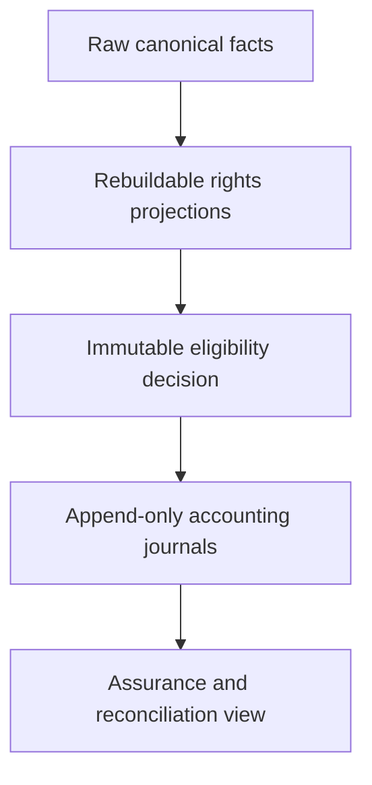
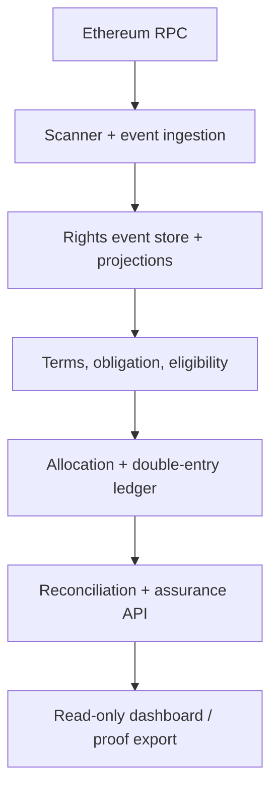
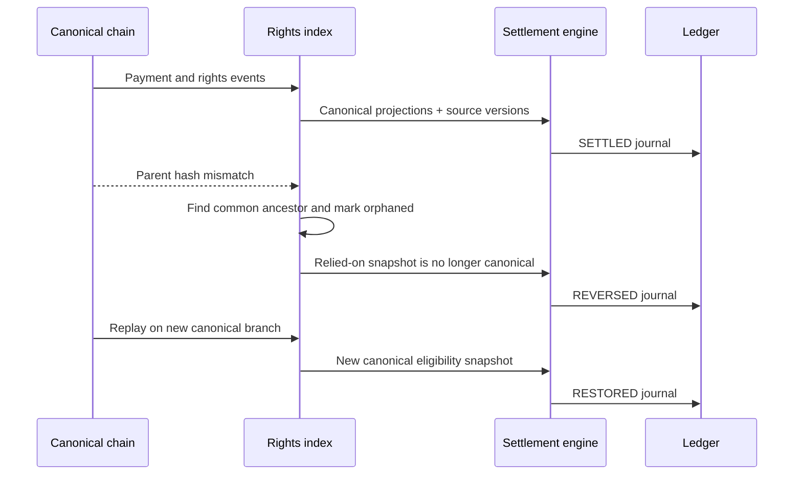
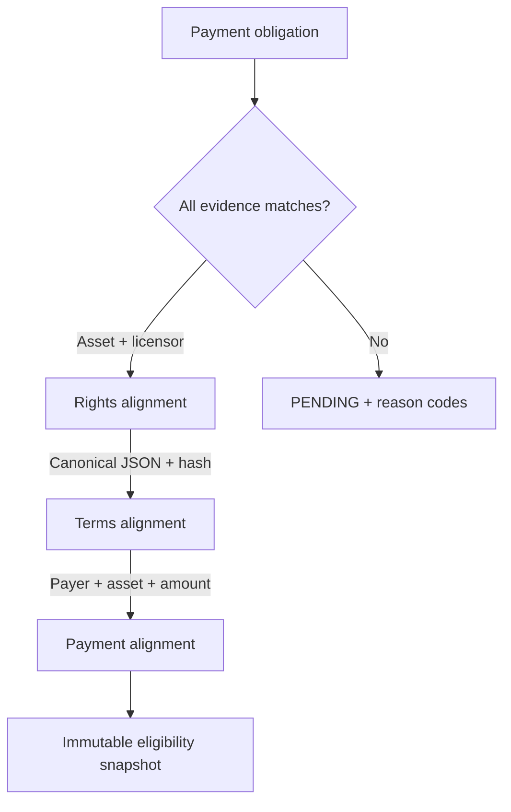
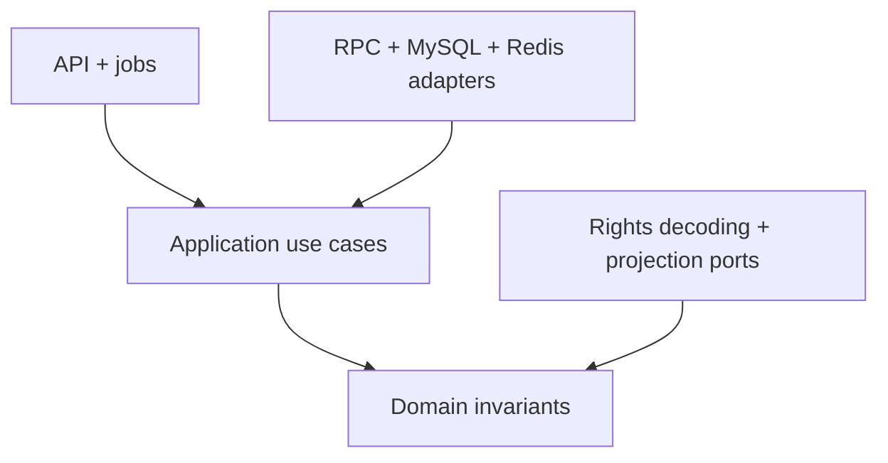

# Architecture and trust boundaries

This document explains why IP Breaker is more than a blockchain event listener. The system converts chain events into settlement decisions and accounting records while keeping the evidence, decision, and consequence independently reviewable.

## One system, four kinds of truth

| Truth layer | What it answers | Persistence rule |
| --- | --- | --- |
| Chain fact | What happened on the current canonical chain? | Raw events are retained; orphaned events are marked, never silently deleted |
| Rights projection | What rights, evidence, and license state follows from those events? | Deterministic and rebuildable from ordered canonical events |
| Decision evidence | Why was this payment eligible at that time? | Immutable snapshot of safe height, source versions, terms, parties, and payment |
| Accounting consequence | What financial effect was recorded? | Append-only, balanced journals; corrections use linked reversal/restoration journals |

The separation matters because a current projection can change without making an earlier decision dishonest, and an accounting correction can be required without deleting the evidence that caused the original posting.

## Component view

| Boundary | Control |
| --- | --- |
| RPC → ingestion | Safe-height limit, bounded retries, block identity and parent-hash validation |
| Ingestion → projection | Stable log ordering, event idempotency, unknown-event retention, code-hash activation gate |
| Projection → eligibility | Fixed-block reads, canonical terms hash, exact party/currency/amount checks |
| Eligibility → ledger | Immutable snapshot reference, deterministic allocation, unique business keys |
| Ledger → assurance | Independent debit/credit checks, reconciliation checkpoints, risk classification |

## Reorganization sequence

Each journal balances independently. The reversal does not mutate the original journal, and restoration does not reactivate it; both are new immutable records linked to the lifecycle.

## Technical reversal versus legal control

| Event | Automated effect | Explicit non-effect |
| --- | --- | --- |
| Relied-on block becomes orphaned | Mark dependent chain evidence/snapshot orphaned; create technical reversal | Do not delete the original event or journal |
| Payment reappears canonically | Re-evaluate; create idempotent restoration when eligible | Do not reuse or edit the original journal |
| Later IP transfer or expiry | Affect future eligibility and actions | Do not automatically invalidate a historically eligible settlement |
| Dispute, hold, or invalidity claim | Enter `HELD / DISPUTED`; block new posting | Do not masquerade as a blockchain reorganization |
| Terms replacement | Create a new version for future decisions | Do not rewrite the terms hash used by an old snapshot |

This is both an engineering and domain-modeling safeguard: chain consensus answers whether a technical fact is canonical; it cannot decide an off-chain legal dispute.

## Eligibility decision

The snapshot is a record of the inputs actually used, including the safe block and projection versions. It is not recalculated in place to resemble the current view.

## Accounting model

Under the current `PAYEE_100_V1` policy, the complete hash-bound payment amount is allocated to the terms manifest payee.

| Journal | Debit | Credit | Purpose |
| --- | --- | --- | --- |
| Original settlement | Escrow funds asset | Payee liability | Recognize eligible licensing revenue obligation |
| Technical reversal | Payee liability | Escrow funds asset | Neutralize an accounting effect whose relied-on chain fact was orphaned |
| Canonical restoration | Escrow funds asset | Payee liability | Recognize the revenue again using new canonical evidence |

Multi-party split percentages are not present in the V1 terms hash, so the backend does not invent platform fees or revenue shares outside the authorized terms.

## Assurance model

Risk, control, and reconciliation are intentionally separate dimensions.

| Dimension | Representative states | Meaning |
| --- | --- | --- |
| Business control | `CLEAR`, `HELD`, `DISPUTED` | Whether policy permits new settlement action |
| Technical risk | `CLEAR`, `ATTENTION`, `BLOCKED`, `CRITICAL` | Index readiness, unknown events, orphaned evidence, unbalanced journals, open differences |
| Reconciliation | `MATCHED`, `DIFFERENCE`, `UNKNOWN` | Whether all required comparisons ran and whether they agreed |

An empty difference table is not enough to claim `MATCHED`: three reconciliation checkpoints must prove that the checks actually ran.

## Module dependency rule

The domain remains independent of Spring, RPC clients, and persistence. Adapters implement ports owned by the inner layers, keeping chain and database mechanics outside the business invariants.

## Trust and claims boundary

The Settlement Proof Package proves deterministic equality of the normalized content by SHA-256 digest. It makes the backend's evidence and decision reproducible; it does not independently prove legal ownership, patent validity, document authenticity, regulatory compliance, or future cash flow.

For presentation guidance, see the [live demo guide](demo-guide.md) and [audience-specific talk tracks](sprint-10-demo-talk-tracks.md).
