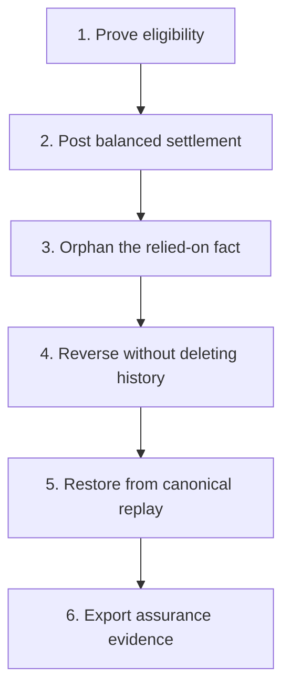
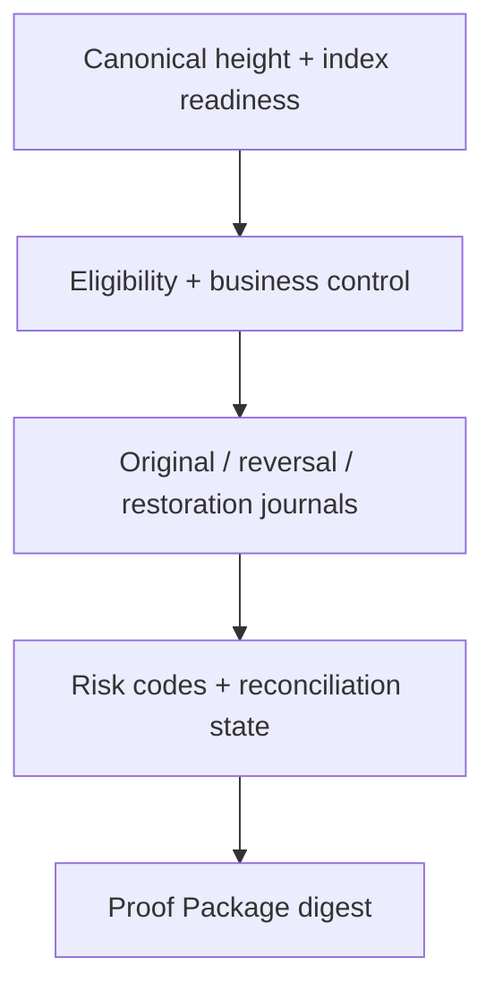

# Live demonstration guide

The demo should prove one idea clearly:

> A chain payment becomes settlement-ready revenue only after rights, terms, parties, amount, and canonical-chain evidence agree.

## Presentation arc



## Choose a duration

| Duration | Show | Skip |
| --- | --- | --- |
| 3 minutes | Dashboard lifecycle, separate journals, final Proof Package digest | Source code and database details |
| 7 minutes | Add eligibility snapshot, reason codes, control versus technical risk | Module-by-module tour |
| 12 minutes | Add scanner/reorg internals, idempotency keys, reconciliation checkpoints, API responses | Only low-level boilerplate |

## Before the demo

- Start MySQL, Redis, and the Java 21 application.
- Confirm `/actuator/health` and `/api/v1/system/status` respond successfully.
- Confirm the three managed contract records have verified runtime code hashes and completed backfills.
- Run all three reconciliation jobs so the dashboard can distinguish `MATCHED` from `UNKNOWN`.
- Prepare executable create, fund, reorg, and restore hooks for an isolated development chain.
- Never use a legal dispute as a substitute for the technical reorganization stage.

```bash
docker compose up --build
curl http://localhost:8080/actuator/health
curl http://localhost:8080/api/v1/system/status
```

## Run the lifecycle

```bash
AGREEMENT_ID=1 \
TERMS_MANIFEST_FILE=/absolute/path/terms.json \
CREATE_HOOK=/absolute/path/create-license.sh \
FUND_HOOK=/absolute/path/fund-license.sh \
REORG_HOOK=/absolute/path/orphan-payment.sh \
RESTORE_HOOK=/absolute/path/restore-payment.sh \
./scripts/sprint10-license-revenue-lifecycle.sh
```

Open the dashboard:

```text
http://localhost:8080/sprint10-dashboard.html
```

The hooks must be executable files. The script does not evaluate command strings, and the reorganization hook must create an isolated technical orphan/replay scenario.

## Evidence to show at each stage

| Stage | Screen or response | Sentence to say |
| --- | --- | --- |
| Terms | Manifest and `termsHash` | “The backend cannot silently change structured terms without breaking the chain-bound hash.” |
| Eligibility | Snapshot source versions and safe block | “This records what the system knew when it authorized posting—not merely today's projection.” |
| Settled | Original journal debit equals credit | “Financial consequence is append-only and independently balanced.” |
| Reversed | Orphaned source plus linked reversal | “We retain the old evidence and neutralize its accounting effect with a new journal.” |
| Restored | New snapshot plus restoration journal | “Canonical replay is re-evaluated and posted idempotently; the old journal is never edited.” |
| Assurance | Risk, control, reconciliation | “No error row is not the same as a completed match; `UNKNOWN` remains visible until checks run.” |
| Proof | Normalized content and SHA-256 digest | “This is a reproducible system audit snapshot, not a legal opinion or third-party audit.” |

## Dashboard reading order



This order keeps the explanation causal: source readiness first, decision second, accounting third, assurance last.

## API checkpoints

```http
GET  /api/v1/license-agreements/{agreementId}/audit-trail?network=SEPOLIA
GET  /api/v1/license-agreements/{agreementId}/assurance-status?network=SEPOLIA
POST /api/v1/license-agreements/{agreementId}/settlement-proof-package?network=SEPOLIA
```

The lifecycle script saves audit-trail, assurance-status, and proof-package JSON for the settled, reversed, and restored stages. Use these artifacts if a live RPC call is slow; say clearly that they are captured outputs rather than a live chain response.

## Likely questions

| Question | Short answer |
| --- | --- |
| Why not trust `LicenseFunded` directly? | It proves a transfer, not rights alignment, unchanged terms, correct payer, asset, or amount. |
| Why make eligibility immutable? | An audit must reconstruct the decision inputs at the time of posting. |
| Why separate reversal journals? | Updating the original erases the evidence of what happened and breaks accounting traceability. |
| Does an IP NFT prove ownership? | No. It indexes evidence and rights-related facts; off-chain ownership and enforceability require legal evidence. |
| Is the Proof Package signed? | No. V1 provides deterministic normalized content and a SHA-256 equality digest. |
| Is this already an investment product? | No. It is the settlement assurance backend on which compliant financing products may later be built. |

## Recovery if the live demo fails

| Symptom | What to inspect | Honest presentation response |
| --- | --- | --- |
| Rights API is not ready | Contract activation, code hash, backfill cursor, rebuild state | Explain the readiness gate; do not bypass it |
| Eligibility remains pending | Reason codes, terms hash, payer, asset, amount | Use the mismatch as a deterministic-decision demonstration |
| Reconciliation is unknown | Completion checkpoints | Explain why absence of differences is not treated as proof |
| Reversal does not occur | Whether the relied-on snapshot/event actually became orphaned | Do not substitute `DISPUTED`; fix the development-chain hook |
| Proof digest changes unexpectedly | Audit/assurance state and normalized payload | Compare material content; generation time and database ID are excluded |

## Claims to avoid

- “The NFT transfers or proves patent ownership.”
- “The platform guarantees the license income.”
- “The Proof Package is a legal opinion, signature, ZK proof, or independent audit.”
- “A dispute automatically reverses settled accounting.”
- “The current V1 product supports compliant issuance, free trading, or multi-party revenue splits.”

Use [the talk tracks](sprint-10-demo-talk-tracks.md) to adapt this evidence to an interviewer, Hackathon judge, or investor.
