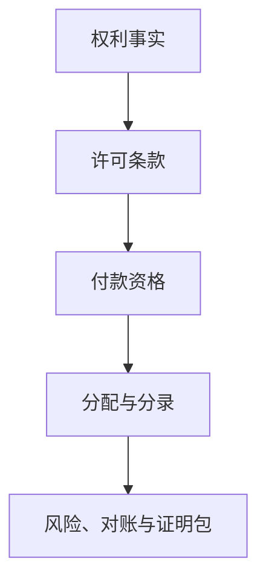

# Sprint 10 讲解材料

三种版本都围绕同一条真实主线：`IP 权利事实 → 许可条款 → 托管付款 → 资格快照 → 收入分配 → 双式分录 → 技术性冲正／恢复`。不要把 NFT 本身说成法律权属，也不要把 Proof Package 说成第三方审计报告。

## 先选讲法

| 对象 | 开场问题 | 重点证据 | 收束句 |
| --- | --- | --- | --- |
| 面试官 | 怎样保证链上入账既幂等又可审计？ | 安全高度、可重建投影、不可变快照、独立平衡分录 | 工程关键是区分链事实失效与法律状态变化 |
| Hackathon 评委 | 收到一笔钱，为什么不等于可结算收入？ | `SETTLED → REVERSED → RESTORED` 现场闭环 | IP Breaker 是 IP 收入的 settlement assurance layer |
| 投资者 | 怎样降低 IP 许可现金流的核验成本？ | 权利—许可—付款—分录全链路与风险／对账状态 | 先建立可信收入事实，再承接合规融资产品层 |

讲解时建议始终按这条因果链推进，不要从模块列表或技术栈开始。

## 一、面试版（约 3–5 分钟）

我做的不是一个只监听充值的 Web3 钱包，而是一个 rights-aware settlement backend。它解决的问题是：链上看到一笔钱，并不等于这笔钱已经具备可结算资格。系统要先证明对应 IP 资产存在、当前权利人与许可方一致、许可条款哈希与结构化条款一致、付款人和金额匹配，并把判断所依据的安全区块、资产版本、许可版本、证据集合哈希和付款事件写入不可变资格快照。

资格成立以后，Sprint 9 才生成确定性分配计划，并用双式记账形成托管资产借记和收款人负债贷记。原结算、冲正和恢复不是修改同一条记录，而是三个独立、平衡、相互关联的 journal。只有区块重组导致原资格事实成为孤块时才自动技术性冲正；后续权利转移或法律争议只改变 `HELD / DISPUTED` 控制状态，不追溯篡改历史账务。

Sprint 10 把这些事实组合成一个全链路审计查询和 Settlement Proof Package。证明包使用规范化 JSON 和 SHA-256 内容摘要，同一状态重复生成结果一致，状态变化则产生新版本；同时输出索引就绪度、当前控制状态、孤块风险、未知事件、分录平衡以及三类对账差异。仪表板不维护自己的演示状态，只消费生产查询接口。

这个项目适合体现的后端能力包括：事件驱动架构、幂等、事务边界、可重建投影、链重组处理、双式账本、可审计数据建模和风险可观测性。工程上的关键取舍是把“链事实失效”和“法律／业务状态变化”分开处理。

可能的追问：

- 为什么不直接相信 `LicenseFunded`？因为付款事件只能证明发生过转账，不能独立证明条款、主体和权利资格。
- 为什么资格快照不可变？因为审计必须回答当时依据了什么，而不是只展示今天的投影视图。
- 为什么冲正不用更新原分录？因为覆盖历史会破坏可追溯性；反向 journal 能保留事实与会计影响。
- Proof Package 是不是零知识证明？不是。当前版本是带内容摘要的可复现审计包，不宣称 ZK、数字签名或第三方鉴证。

## 二、Hackathon 版（约 2 分钟）

IP Breaker 把一笔 IP 许可收入从“链上收到了钱”提升为“这笔收入为什么可以被结算”。

演示中，我们先创建一份与链上 `termsHash` 一致的结构化许可条款。许可付款进入托管后，后端把 IP 资产、证据、许可双方、付款人、金额和安全区块固化为资格快照；只有全部匹配，才生成分配计划和双式分录。

接着我们模拟一次区块重组。原付款和资格快照被标记为孤块，系统不删除历史，而是自动生成完全反向的冲正 journal。付款在新规范链重新出现后，系统以新的资格快照生成恢复 journal。三组分录彼此独立、各自平衡，并保留原始、冲正、恢复的关联 ID。

最后，Settlement Assurance Dashboard 展示权利、许可、付款、资格和账本全链路，标出 `HELD / DISPUTED`、未知事件、索引重建、孤块快照和对账差异；一键导出的 Proof Package 带 SHA-256 内容摘要，可交给财务、投资人或审计系统复核。

一句话收束：**IP Breaker is the settlement assurance layer for IP revenue—not “NFT equals ownership,” but verifiable rights, payment eligibility, and auditable revenue accounting.**

## 三、投资者版（约 90 秒）

IP 收益融资面临的核心障碍，不只是资产有没有上链，而是收入能否被持续验证、解释和对账。资金方需要知道：谁拥有相关权利、许可条款是什么、付款是否满足条款、收入如何分配，以及链异常或争议发生后账务如何处理。

IP Breaker 提供一层面向 IP 收入的结算保障基础设施。系统把链上权利和许可事件，与结构化条款、付款资格、资金分配及双式账本连接起来，并为每笔收入生成可复核的 Settlement Proof Package。发生技术性链重组时，系统自动冲正并在规范事实恢复后重新入账；发生法律或业务争议时，系统冻结新的处置，但不篡改历史。

早期产品聚焦单链、单结算资产和已经存在许可现金流的场景，先把 escrow、revenue proof 和 reconciliation 跑通。它可以作为 IP 融资平台、版权许可市场和托管机构的后端 assurance layer，降低尽调、持续监控和收益核验的成本。

投资者表述边界：当前 Proof Package 是平台生成的加密摘要审计包，不应表述为独立审计意见；代币化、融资发行和多方分润属于后续建立在可信收入事实之上的产品层。

## 四、演示画面提示卡

| 讲到这里 | 切换画面 | 指给对方看 |
| --- | --- | --- |
| “不是看到付款就入账” | Eligibility | 安全区块、条款哈希、付款人、金额及原因码 |
| “历史不能被覆盖” | Journals | 原结算、冲正、恢复三个关联 ID 及各自借贷平衡 |
| “争议不是重组” | Assurance | `HELD / DISPUTED` 与 orphan/reorg 风险分别展示 |
| “没有差异不等于已经对账” | Reconciliation | `MATCHED / DIFFERENCE / UNKNOWN` 及完成检查点 |
| “输出可复核材料” | Proof Package | 规范化内容与 SHA-256 digest，并主动说明用途边界 |

完整操作顺序见 [Live demonstration guide](demo-guide.md)，系统设计见 [Architecture and trust boundaries](architecture.md)。
