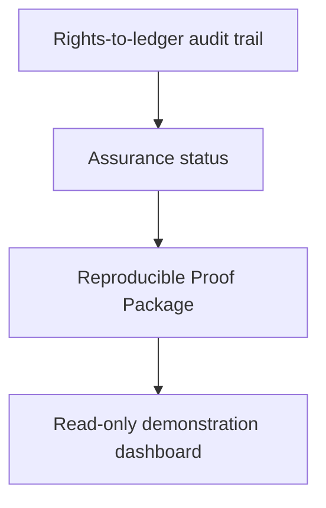
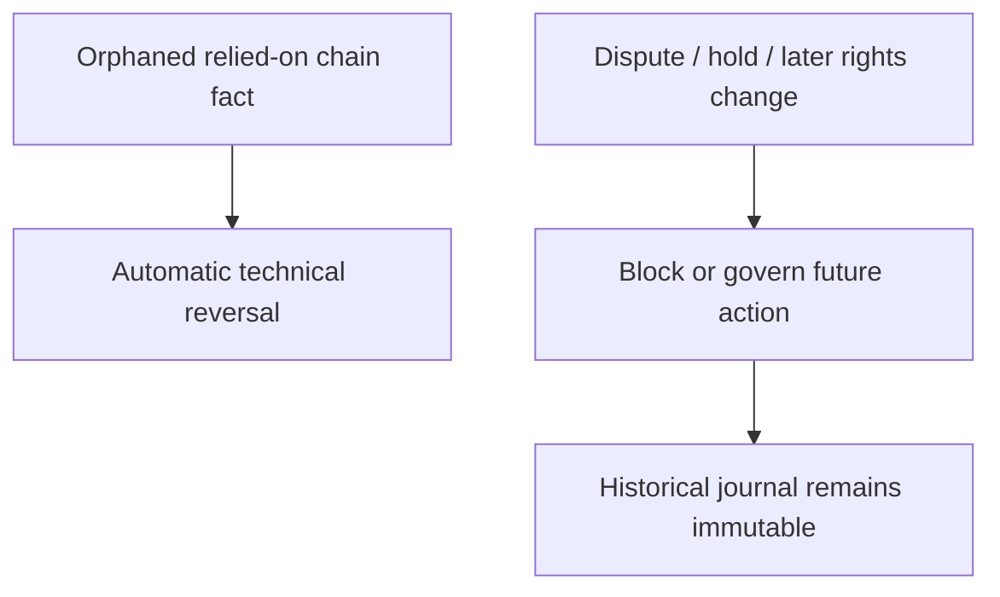

# Sprint 10 — Audit Proof and Financing Demo



## Outcome

Sprint 10 turns the rights-aware settlement data built in Sprints 7–9 into a reviewable assurance surface. It adds no new smart contracts and does not change settlement accounting semantics.

## Delivered scope

- `GET /api/v1/license-agreements/{agreementId}/audit-trail`
  returns the linked asset, evidence, license, terms, obligation, payment, eligibility snapshots, allocation plans, settlement records, ledger transactions, entries, and source chain events.
- `GET /api/v1/license-agreements/{agreementId}/assurance-status`
  separates business control, index readiness, technical risk, and reconciliation state.
- Reconciliation completion checkpoints distinguish a completed clean run from a check that has
  never run; ledger and deposit checks are now scoped to the requested network, and the existing
  Sepolia network-status predicate is aligned with the seeded `ACTIVE` value.
- `POST /api/v1/license-agreements/{agreementId}/settlement-proof-package`
  persists and returns a reproducible `SETTLEMENT_PROOF_V1` package with a SHA-256 content digest.
- `/sprint10-dashboard.html`
  renders the production query responses and downloads proof packages without maintaining parallel demo state.
- `scripts/sprint10-license-revenue-lifecycle.sh`
  orchestrates creation, terms registration, funding, technical reorganization, canonical restoration, proof capture, and journal-balance verification through explicit executable hooks.
- `docs/sprint-10-demo-talk-tracks.md`
  provides interview, Hackathon, and investor narratives with explicit claims boundaries.

## Assurance semantics

| Status | Trigger examples | Presentation meaning |
| --- | --- | --- |
| `CLEAR` | No currently detected system risk code | System checks are currently clear; **not** a legal opinion |
| `ATTENTION` | Unknown events or reversal awaiting restoration | Review is useful, but the issue is not currently classified as blocking |
| `BLOCKED` | Index/control gate or reconciliation not run | Do not present the agreement as settlement-ready |
| `CRITICAL` | Orphaned current snapshot, unbalanced journal, or open reconciliation difference | Immediate technical/accounting investigation is required |

Reconciliation is a separate result:

| State | Meaning |
| --- | --- |
| `MATCHED` | All three required checks completed and no difference remains |
| `DIFFERENCE` | At least one completed comparison found an open difference |
| `UNKNOWN` | The required reconciliation checkpoints have not all been recorded |

`CLEAR` means no currently detected system risk code. It is not a legal opinion. `BLOCKED` indicates an index, reconciliation-execution, or control gate; `CRITICAL` indicates an orphaned current eligibility snapshot, an unbalanced settlement journal, or an open reconciliation difference; `ATTENTION` covers non-blocking unknown events or a reversal awaiting canonical restoration. Reconciliation remains `UNKNOWN` until all three checks have persisted a completion checkpoint; an empty difference table alone is never treated as evidence of a match.

Legal/business changes remain orthogonal to technical reversals. `HELD` and `DISPUTED` block new posting, while only orphaned chain facts can trigger automated reversal and idempotent restoration.



## Proof package integrity

The package digest is calculated over alphabetically ordered JSON properties and map keys using SHA-256. Generation time, database ID, and disclaimer are outside the hashed material. Repeating generation against identical audit and assurance content reuses the stored package through `(network, agreement, content_hash)` uniqueness. Any material state change produces a new proof record.

The digest proves content equality only. It is not a digital signature, zero-knowledge proof, legal opinion, or independent assurance report.

## Demo hooks

The lifecycle script requires executable hooks rather than evaluating shell command strings:

```bash
AGREEMENT_ID=1 \
TERMS_MANIFEST_FILE=/absolute/path/terms.json \
CREATE_HOOK=/absolute/path/create-license.sh \
FUND_HOOK=/absolute/path/fund-license.sh \
REORG_HOOK=/absolute/path/orphan-payment.sh \
RESTORE_HOOK=/absolute/path/restore-payment.sh \
./scripts/sprint10-license-revenue-lifecycle.sh
```

`REORG_HOOK` must create a technical orphan/replay scenario in an isolated development chain. A legal dispute must not be used as a substitute for reorganization.

## Migration

Flyway V12 adds immutable `settlement_proof_package` records. It stores the exact hashed material, content digest, relevant obligation and latest settlement references, and generation time.

## Definition of done

- Maven test and verification lifecycle passes on Java 21.
- V1–V12 migrations apply to a clean MySQL 8.4 database.
- Repeated proof generation on unchanged state returns the same proof ID and digest.
- A state transition changes the proof digest.
- Every settlement journal shown in the dashboard balances independently.
- The demo reaches `SETTLED → REVERSED → RESTORED` using a technical reorganization.

## Presentation resources

- [Architecture and trust boundaries](architecture.md)
- [Live demonstration guide](demo-guide.md)
- [Interview, Hackathon, and investor talk tracks](sprint-10-demo-talk-tracks.md)
