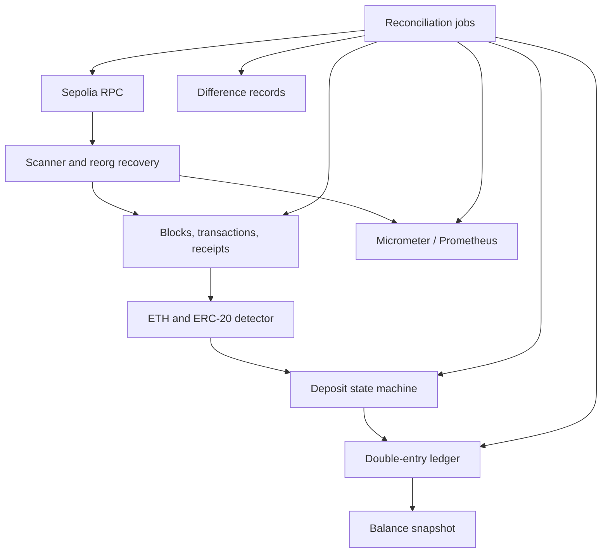
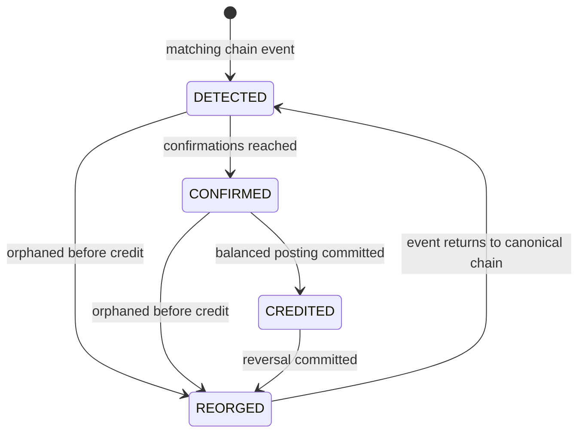

# Sprint 6: reconciliation, observability, and Sepolia demonstration

## Acceptance checklist

- Recompute each ledger account from immutable entries and compare it with its balance snapshot.
- Verify every credited deposit has exactly one two-entry deposit posting with matching amounts.
- At one committed scanner height, sum ETH and ERC-20 balances across all custody-pool addresses
  and compare each asset with the platform asset ledger account.
- Persist differences idempotently, count repeated occurrences, resolve disappeared differences,
  and reopen recurring differences.
- Export scanner height, safe height, lag, RPC latency, RPC failures, reconciliation differences,
  and reconciliation failures through `/actuator/prometheus`.
- Run `scripts/sepolia-demo.sh` against a configured Sepolia and MySQL deployment.

## Architecture

## Deposit state

## Interview explanation

The immutable ledger entries are the accounting source of truth. `account_balance` is only a
rebuildable read projection, so the first reconciliation independently recomputes it. The second
reconciliation starts from deposits and proves that the business event reached the ledger exactly
once with the correct debit and credit. The third crosses the system boundary: it reads actual
Sepolia custody balances and compares them with the platform asset accounts.

Differences are operational records rather than log lines. A stable database unique key prevents
alert storms, `occurrence_count` shows persistence, and a clean run resolves an open difference.
The metrics answer three incident questions quickly: whether scanning is moving, how far it trails
the safe height, and whether RPC or reconciliation is failing.

The strongest demonstration is to introduce a controlled snapshot mismatch in a local database,
run reconciliation, show the open difference, repair the snapshot, and show the same record become
`RESOLVED`. The Sepolia script then demonstrates the external chain path without embedding a key or
automatically sending funds.
