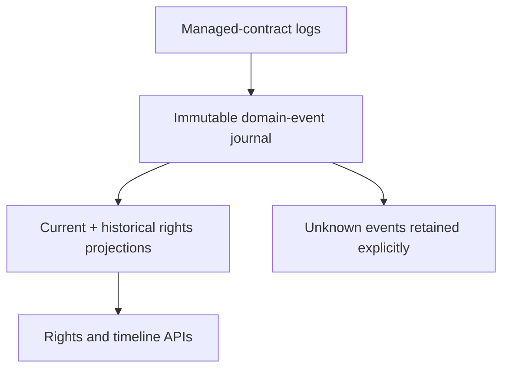
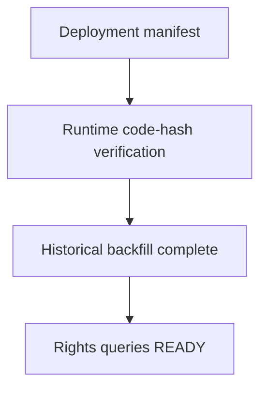
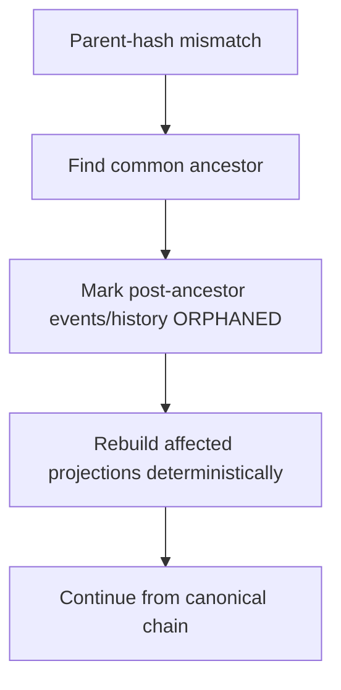

# Sprint 7 — IP contract indexing and rights projections

Sprint 7 changes the product direction to **IP Breaker Rights-Aware Settlement Backend**. It indexes
safe-chain facts from `IPAssetRegistry`, `EvidenceRegistry`, and `LicenseEscrow`, normalizes them into
an immutable domain-event journal, and builds rebuildable asset, evidence, and escrow-agreement
projections. It does not create settlement obligations, distribute revenue, or make legal-validity
decisions.



## Delivered

- `ip-breaker-wallet-rights`: managed-contract catalog, pinned topic decoder, canonical payload hash,
  projection/query ports, and backfill cursor model.
- Flyway V9: managed contracts, domain/unknown events, three current projections, projection history,
  rebuild audit, transaction calldata, and independent backfill cursors.
- The normal block transaction now persists transaction input, decodes successful managed-contract
  logs in `(block, transactionIndex, logIndex)` order, updates projections, and only then commits the
  pre-existing deposit work and scanner cursor.
- Unknown topics are journaled without blocking the cursor. Malformed known events and projection
  transition violations roll back the block.
- Reorganization rollback marks post-ancestor facts/history orphaned and deterministically rebuilds
  only affected aggregates from canonical events.
- Historical backfill has an independent leased cursor and never rewinds the money scanner.
- Query endpoints:
  - `GET /api/v1/ip-assets/{assetId}`
  - `GET /api/v1/ip-assets/{assetId}/timeline`
  - `GET /api/v1/license-agreements/{agreementId}`

## Activation gate



No historical candidate address is seeded as `ACTIVE`. Complete
`config/rights/deployment-manifest.json`, compare deployed runtime bytecode with the pinned contract
artifacts, and insert verified lowercase addresses into `chain_contract`. This prevents an ABI/source
mismatch from being treated as an indexable fact.

Example activation (values intentionally placeholders):

```sql
INSERT INTO chain_contract (
    network_id, contract_type, contract_address, abi_version, deployment_block,
    deployment_tx_hash, runtime_code_hash, status
) SELECT id, 'IP_ASSET_REGISTRY', '0x...', 'rwa-9adaba8-v1', 0,
         '0x...', '0x...', 'ACTIVE'
    FROM chain_network WHERE network_code = 'SEPOLIA';
```

## Operational rules

- Run the V9 migration before activating contracts.
- Backfill target is fixed when each cursor is first created at
  `min(wallet scanner height, safe height)`.
- A missing origin or invalid state transition stops normal scanning until backfill restores the
  required canonical history.
- Public timelines return canonical events only and use an opaque keyset cursor.
- Amounts and uint256 identifiers remain decimal strings/`BigInteger`; no floating point is used.

### Reorganization rule



Even when an orphaned block contains only unknown events and no aggregate projection can be rebuilt,
those events are still marked `ORPHANED`; “nothing to project” never leaves them classified as
canonical facts.

## Verification

Run `./mvnw verify` with Java 21 and MySQL available. The current managed environment may require a
writable `MAVEN_USER_HOME`; Maven Central access is also required when the distribution/dependencies
are not already cached.
