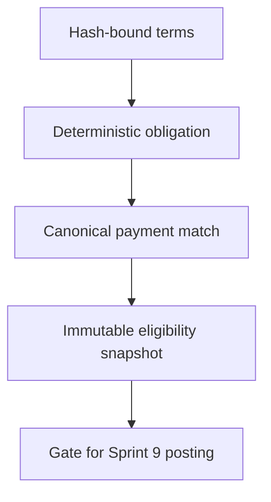
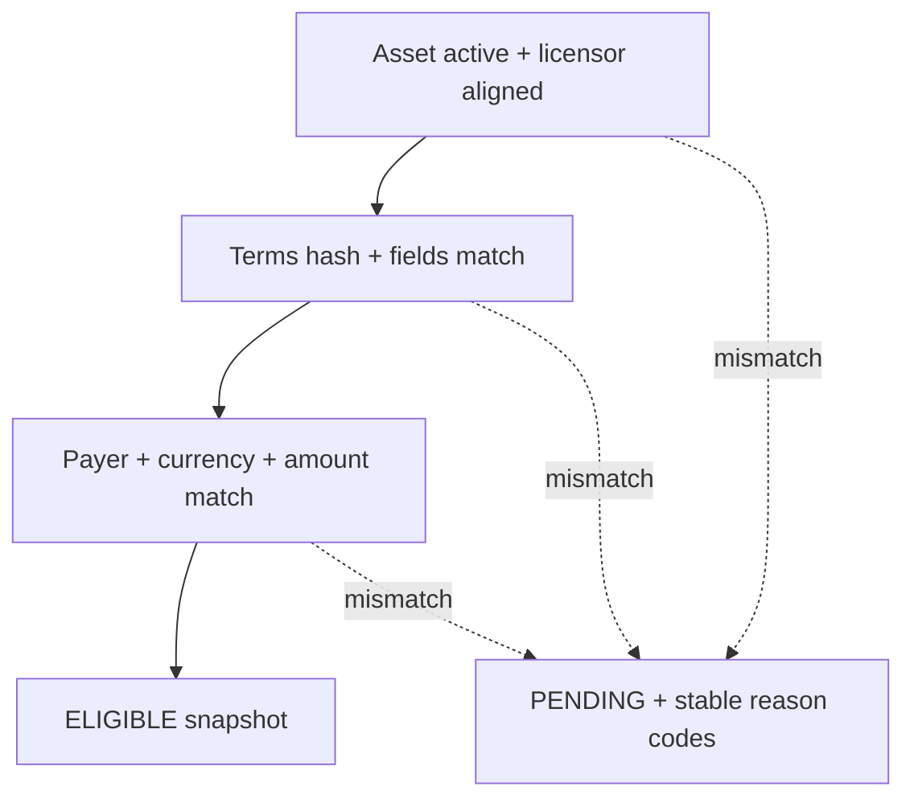

# Sprint 8 — License obligations and settlement eligibility

Sprint 8 turns a canonical `LicenseAgreement` projection into a deterministic payment obligation and
decides whether a canonical escrow funding event is eligible for settlement. It deliberately stops
before ledger posting, revenue distribution, reversal postings, refunds, or legal adjudication; those
belong to Sprint 9 or an authorized control workflow.



## Structured terms workflow

The client first prepares a versioned manifest and obtains its canonical JSON and `keccak256` hash:

```http
POST /api/v1/license-agreements/terms-manifests/hash
```

The exact returned hash is used as `termsHash` when creating the on-chain agreement. After Sprint 7
has indexed that agreement, register the same manifest:

```http
POST /api/v1/license-agreements/{agreementId}/terms-manifests?network=SEPOLIA
GET  /api/v1/license-agreements/{agreementId}/payment-obligation?network=SEPOLIA
```

Schema version 1 contains `termsVersion`, `assetId`, `licensor`, `licensee`, `payer`, `payee`,
`currency`, and integer base-unit `amount`. Addresses are lowercased before hashing. The current
`LicenseEscrow` accepts only `NATIVE` currency. Registration is idempotent for the same agreement,
version, and canonical content; a conflicting version returns HTTP 409.

## Eligibility rules

An obligation becomes `ELIGIBLE` only when every rule passes:

- the asset exists and is `ACTIVE`;
- the current projected asset owner equals the agreement licensor;
- manifest hash, asset, parties, currency, and amount match the canonical agreement;
- payer is the licensee and payee is the licensor;
- a canonical `LicenseFunded` event exists;
- the event payer and amount match the obligation.
- the agreement has not entered a disputed or terminal lifecycle state.

Every evaluation creates an immutable `settlement_eligibility_snapshot` containing the safe block,
asset and license projection versions/source events, evidence-set hash, terms version/hash, parties,
payment event, decision, and stable reason codes. `ELIGIBLE` authorizes Sprint 9 to consider posting;
it is not itself a ledger transaction or proof that funds were distributed.

Ownership is evaluated when the obligation is registered and when its agreement/payment facts
change. A later asset transfer does not retroactively invalidate an earlier eligible payment; it
affects later obligations. Legal invalidity, disputes, and court orders enter the separate control
workflow instead of silently rewriting this technical decision.



## Orthogonal state

Sprint 8 keeps settlement progress and control state separate:

```text
settlement_status: PENDING / ELIGIBLE
control_status:    CLEAR / HELD / DISPUTED
```

Legal disputes and manual controls must not rewrite historical eligibility decisions. Sprint 8 maps
canonical on-chain dispute raise/resolve events to `DISPUTED`/`CLEAR`; it does not expose manual
control mutations because the authorization and legal disposition workflow has not yet been
implemented.

| Settlement state | Control state | Operational meaning |
| --- | --- | --- |
| `PENDING` | `CLEAR` | Evidence does not yet authorize posting |
| `ELIGIBLE` | `CLEAR` | Sprint 9 may consider posting |
| `ELIGIBLE` | `HELD` | Evidence matched, but policy blocks new posting |
| `ELIGIBLE` | `DISPUTED` | Historical decision remains visible; dispute workflow governs new action |

## Reorganization behavior

When Sprint 7 rolls back to a common ancestor, payment matches and eligibility snapshots above that
ancestor are retained as `ORPHANED`. Rights projections are rebuilt first, then obligations whose
current decision was orphaned are re-evaluated against the ancestor hash. Canonical-chain replay can
restore eligibility idempotently without changing an unaffected historical decision.

## Database additions

Flyway V10 adds:

- `license_terms_manifest`
- `payment_obligation`
- `payment_obligation_match`
- `settlement_eligibility_snapshot`

No Sprint 8 table creates a ledger entry or balance mutation.

## Verification

Run `./mvnw verify` with Java 21 and MySQL 8 available. Acceptance should cover canonical hashing,
idempotent manifest registration, every reason code, correct payer/amount matching, event-order
reevaluation, duplicate scans, reorg orphaning/recalculation, and the guarantee that no ledger table
changes during eligibility evaluation.
